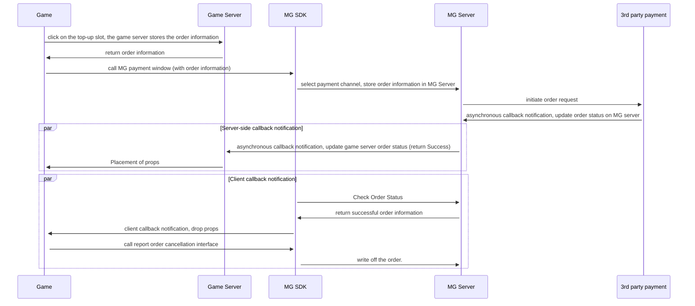

# Android SDK Payments

## 1、 Introduction
　　 This article describes how to integrate with the Miracle Games Android SDK payment interface, open the payment method selection window, and receive payment callbacks.

## 2、 User Payment Flowchart
### It is recommended to realise payment according to the following flow
●  When initiating a payment call, an order number is generated in the developer's system and then passed to the payment interface via the comment parameter.<br>
●  After the payment process is completed, the Miracle Games server will launch a callback to the developer, which contains the comment information, through which the developer can mark the order number as a successful payment.<br>
●  When multiple in-game items share the same price point, there's no need to create individual products for each item in the Miracle Games backend. Instead, a single universal product can be established. When calling the payment interface, pass the item ID to the comment parameter. Upon payment completion, Miracle Games will deliver this comment parameter directly to the developer. Developers can then distribute the corresponding items based on this parameter.<br>
●  When the game server receives the callback notification from the MG server, it needs to use the product_tag parameter to compare with the game order information, or use the product_price_usd parameter to compare with the price of the props to check, and then the props will be released if it passes the check. product_tag parameter is an attribute that is maintained by the background of the developer. The name of the attribute is"custom_tag"，, and it is recommended to store the ID of the product, MG server will pass the value of this attribute to the game server after url encoding.<br>
●  If the developer doesn't have a server, he can receive the callback event through the client to complete the game props issuance.<br>


## 3、 User pays
　　 A call to this interface opens the platform's payment interface. A responsive payment callback message is sent when the user's payment is complete or canceled.
```java
// this is an Android Activity object	
// goodsKey: the product key, generated by MiracleGames when creating the product. 
// comment: custom parameter, urlencode it before passing it, and return it to the developer as is when the payment is completed.
// callbackId: null, the server callback address Id, generated by MiracleGames when setting up the callback address, developers can set up multiple callback addresses, the transaction will be given to the specified Id of the callback address to initiate a callback for a successful payment.
//  If a callback address is set, but no id is specified, i.e. CallbackId=null, the default callback address will be used; if an Id is specified, but it does not exist, it will not be paid. If you don't use server callback, please ignore this attribute.
MGSdkPlatform.getInstance().pay(this, goodsKey, comment, callbackId,
	new MGPayListener() { 
		@Override
		public void onSuccess(String msg) {
			//No processing required
		}
		@Override
		public void onFailed(String msg) {
			//No processing required
		}
	}
);
```

## 4、 Server-side callback to developer server after successful payment
　　After the player's payment is complete, Miracle Games will call back the developer based on the application callback address created by the developer on the Miracle Games Developer Platform [(Ref.)](https://doc.mguwp.net/en/appcallback.html), which notifies the developer server of the payment result as a parameter in the form of a GET request.<br>
　　For the complete server-to-server callback procedure and decryption process, please refer to[（Section 4: Post-Payment Callback to Developer Server）](https://doc.mguwp.net/en/androidpayment.html)
## 5、 Receive client callback event after successful payment
　　 If the game has a server to receive callbacks, there is no need to access this feature, and you can directly access the payment callbacks on the server side.<br>
　　● Register the client-side payment callback event, recommended to be placed in the onCreate method
```java
protected void onCreate(Bundle savedInstanceState) {
	super.onCreate(savedInstanceState);

	MGSdkPlatform.getInstance().Assets(new MGAssetsListener() {
		@Override
		public void onSuccess(ArrayList assetsInfoList) {

			Log.d(TAG, "Asset change;" + "assetsInfoList===" + assetsInfoList.size());
			desc+="Asset change,assetsInfoList.size():=" + assetsInfoList.size()+"\n";
			for (AssetsInfo assetInfo : assetsInfoList) {
				//Developer here, for prop decentralization

				MGSdkPlatform.getInstance().ReportFulfillmentAsync(assetInfo);//report write-offs
			}
			desc+="Assets have been written off";
		}
	});

}
```
