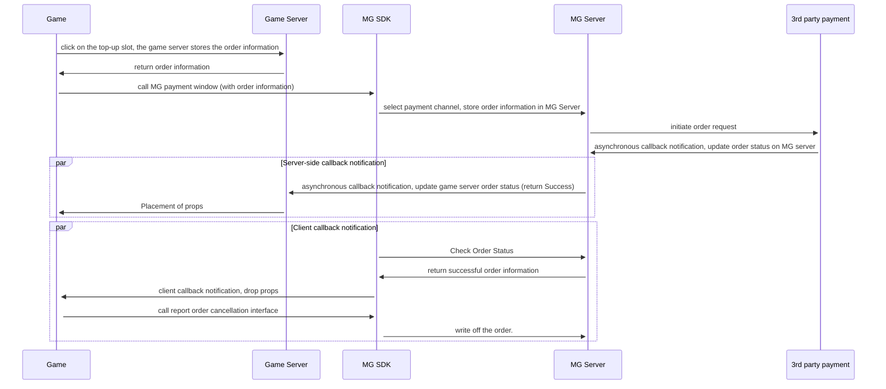

# Unity Access to Android SDK Payments

## 1、 Introduction
　　 This article explains how to integrate the payment interface of the Miracle Games Android SDK in the Unity engine to launch the payment method selection window and receive payment callbacks.

## 2、 User Payment Flowchart
### It is recommended to realise payment according to the following flow
●  When initiating a payment call, an order number is generated in the developer's system and then passed to the payment interface via the comment parameter.<br>
●  After the payment process is completed, the Miracle Games server will launch a callback to the developer, which contains the comment information, through which the developer can mark the order number as a successful payment.<br>
●  When multiple in-game items share the same price point, there's no need to create individual products for each item in the Miracle Games backend. Instead, a single universal product can be established. When calling the payment interface, pass the item ID to the comment parameter. Upon payment completion, Miracle Games will deliver this comment parameter directly to the developer. Developers can then distribute the corresponding items based on this parameter.<br>
●  When the game server receives the callback notification from the MG server, it needs to use the product_tag parameter to compare with the game order information, or use the product_price_usd parameter to compare with the price of the props to check, and then the props will be released if it passes the check. product_tag parameter is an attribute that is maintained by the background of the developer. The name of the attribute is"custom_tag"，, and it is recommended to store the ID of the product, MG server will pass the value of this attribute to the game server after url encoding.<br>
●  If the developer doesn't have a server, he can receive the callback event through the client to complete the game props issuance.<br>


## 3、 Payment interface
Interface Description:<br>

Calling this interface opens the platform's payment interface. A payment callback message is sent when the user's payment is complete or canceled.<br>

Method Definition:void payPurchase(String goodskey, String comment, String callbackId)<br>

Parameter Description:<br>

goodskey: Product Key, generated by MiracleGames when creating a product.<br>

comment: custom parameter, urlencode before passing, will return the parameter to the developer as is after completing the payment.<br>

callbackId: payment callback id, generated when creating the callback address. After the payment is completed, MiracleGames will call the url corresponding to this ID to notify the developer of the payment result.<br>

Example of an interface call:<br>
```C#
public void Pay() {
	using (AndroidJavaClass jc = new AndroidJavaClass("com.unity3d.player.UnityPlayer"))  {
		using (AndroidJavaObject jo = jc.GetStatic("currentActivity")) {
			jo.Call("payPurchase", "93C97BDFF86AF61", "comment", "");
		}
	}
}
```

## 4、 Server-side callback to developer server after successful payment
　　After the player's payment is complete, Miracle Games will call back the developer based on the application callback address created by the developer on the Miracle Games Developer Platform [(Ref.)](https://doc.mguwp.net/en/appcallback.html), which notifies the developer server of the payment result as a parameter in the form of a GET request.<br>
　　For the complete server-to-server callback procedure and decryption process, please refer to[（Section 4: Post-Payment Callback to Developer Server）](https://doc.mguwp.net/en/unityandroidsdkpay.html)
## 5、 Receive client callback event after successful payment
If the game has a server to receive callbacks, then there is no need to access this function, directly access the server side of the payment callback.<br>
Before accessing the client-side callback, you need to configure the game type identifier in the Activity, and set it to "true" to indicate a single-player game.<br>
Example:<br>
```Xml
<!-- Game type representation -->
<meta-data
	android:name="SINGLE_GAME"
	android:value="true" > <!--true for single player games false for online games-->
</meta-data>
```
Interface Description: For single-player games without servers, players need to make client-side callbacks after successful payment and send props to write off the order.<br>

Method Definition:void onAssetsChange(string message)<br>

Parameter Description:<br>

The message parameter value is: "xx,xx,xx,xx,xx,xx..." . Separated by commas.<br>

The first value is the product order number<br>

The second value is a user-defined parameter, assigned by the user when initiating a payment, and originally returned after a successful payment.<br>

The third value is the name of the product<br>

The fourth value is the number of items<br>

The 5th value is the commodity label<br>

Example:<br>
```C#
void onAssetsChange(string message)
    {
        Debug.Log("===onAssetsChange : " + message);

        string[] temp = message.Split(new char[] { ',' });
        if (temp != null && temp.Length >= 0)
        {
            string product_id = temp[0]; //MG order number
            string comment = temp[1];  //customize the passthrough parameter
            string goodsNam = temp[2]; //goods name
            string goodsNum = temp[3]; //number of goods
            string goodsTag = temp[4]; //goods tag
            Debug.Log("Sending props");
            ReportAssestFulfillment(product_id);//write off the order after props are sent out
        }
    }
```
## 6、 Write-off of assets
If the game has a server to receive the callbacks, there is no need to access this feature, and you can directly access the payment callbacks on the server side.<br>
Interface Description: After sending props to the user, you need to call this interface to write off the asset order, otherwise every initialization will send the client information about the order, prompting that it has not been written off.<br>

Method Definition:void ReportAssestFulfillment(String id)<br>

Example:<br>
```C#
void ReportAssestFulfillment(string id)
    {
        using (AndroidJavaClass jc = new AndroidJavaClass("com.unity3d.player.UnityPlayer"))
        {
            using (AndroidJavaObject jo = jc.GetStatic("currentActivity"))
            {
                jo.Call("ReportAssestFulfillment", id);//id: merchandise order number, the first parameter value returned by the asset change client callback
            }
        }
    }
```