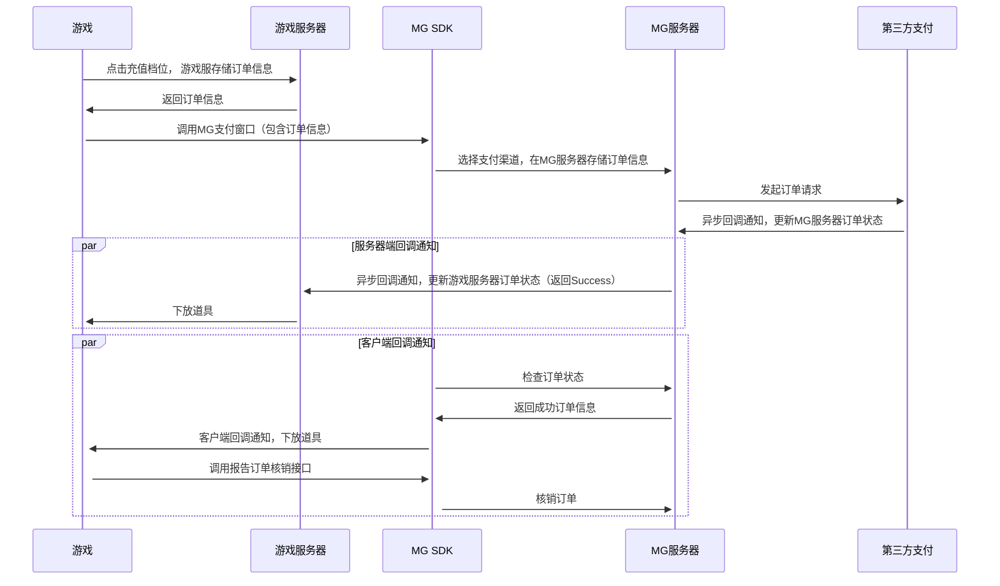

# Unity接入Android SDK支付

## 1、 简介
　　 本文介绍了Unity引擎中如何对接Miracle Games Android SDK的支付接口，打开支付方式选择窗口并接收支付回调。

## 2、 用户支付流程
### 推荐按以下流程实现支付
●  在发起支付调用时，在开发者的系统中先生成一个订单号，然后把此订单号通过comment参数传递给支付接口<br>
●  支付过程完成后，会由Miracle Games的服务器给开发者发起回调，其中包含了此comment信息，开发者可以通过此将该订单号标记为支付成功<br>
●  当游戏内存在多个价格相同的道具时，无需在MG后台为每个道具单独创建商品，只需创建一个通用商品即可。在调用支付接口时，将道具id传给conmment参数，支付完成后，MG会将此comment参数透传给开发者。开发者可依据此参数进行不同道具的下放。<br>
●  游戏服务器在收到MG服务器的回调通知时，需使用product_tag参数同游戏订单信息对比校验，或使用product_price_usd参数同道具价格对比校验，校验通过则下放道具。product_tag参数为开发者后台中维护的属性。属性名为"<span  style="color:blue"> 自定义标签"，建议存储道具ID。MG服务器会将此属性值经过 url编码后传给游戏服务器。<br>
●  若开发者没有服务器，则可以通过客户端接收回调事件，完成游戏道具的发放<br>

## 3、 支付接口
接口说明：<br>

调用该接口后，会打开平台的支付界面。当用户支付完成或取消支付时，会发送支付回调消息。<br>

方法定义：void payPurchase(String goodskey, String comment, String callbackId)<br>

参数说明：<br>

goodskey：商品Key, 创建商品时由MiracleGames生成<br>

comment：自定义参数，传递前进行urlencode，完成支付后会把该参数原样返回给开发者。<br>

callbackId：支付回调标识，创建回调地址时产生。完成支付后MiracleGames会调用该标识对应的url，把支付的结果通知开发者。<br>

接口调用示例：<br>
```C#
public void Pay() {
	using (AndroidJavaClass jc = new AndroidJavaClass("com.unity3d.player.UnityPlayer"))  {
		using (AndroidJavaObject jo = jc.GetStatic("currentActivity")) {
			jo.Call("payPurchase", "93C97BDFF86AF61", "comment", "");
		}
	}
}
```

## 4、 支付成功后服务器端回调开发者服务器
　　在玩家支付完成之后，Miracle Games会根据开发者在Miracle Games开发者平台上创建的应用回调地址[（参考）](https://doc.mguwp.net/appcallback.html)，通过GET请求的形式将支付结果作为参数通知到开发者服务器。<br>
　　完整的服务器回调以及解密流程，请参考链接中的[（第四章节：支付成功后服务器端回调开发者服务器）](https://doc.mguwp.net/unityandroidsdkpay.html)
## 5、 资产变更客户端回调接口
如果游戏有服务器可接收回调，则无需接入此功能，直接接入服务器端的支付回调。<br>
接入客户端回调前需要对Activity中的游戏类型标识进行配置，设置为“true”表示单机游戏<br>
示例：<br>
```Xml
<!-- 游戏类型表示 -->
<meta-data
	android:name="SINGLE_GAME"
	android:value="true" > <!--true为单机游戏  false为网游/-->
</meta-data>
```
接口说明：对于没有服务器的单机游戏，玩家支付成功后需要进行客户端的回调，发送道具后核销订单。<br>

方法定义：void onAssetsChange(string message)<br>

参数说明：<br>

message参数值为："xx,xx,xx,xx,xx..."。用逗号分隔。<br>

第1个值为商品订单号<br>

第2个值为用户自定义参数，由用户发起支付时赋值，支付成功后原本返回<br>

第3个值为商品名称<br>

第4个值为商品数量<br>

第5个值为商品标签<br>

示例：<br>
```C#
void onAssetsChange(string message)
    {
        Debug.Log("===onAssetsChange : " + message);

        string[] temp = message.Split(new char[] { ',' });
        if (temp != null && temp.Length >= 0)
        {
            string product_id = temp[0]; //MG订单号
            string comment = temp[1];  //自定义透传参数
            string goodsNam = temp[2]; //商品名称
            string goodsNum = temp[3]; //商品数量
            string goodsTag = temp[4]; //商品标签
            Debug.Log("发送道具");
            ReportAssestFulfillment(product_id);//道具发送完成后核销订单
        }
    }
```
## 6、 资产核销
如果游戏有服务器可接收回调，则无需接入此功能，直接接入服务器端的支付回调。<br>
接口说明：给用户发送道具后，需要调用该接口，对资产订单进行核销，否则每次初始化都会给客户端发送该笔订单信息，提示未核销。<br>

方法定义：void ReportAssestFulfillment(String id)<br>

示例：<br>
```C#
void ReportAssestFulfillment(string id)
    {
        using (AndroidJavaClass jc = new AndroidJavaClass("com.unity3d.player.UnityPlayer"))
        {
            using (AndroidJavaObject jo = jc.GetStatic("currentActivity"))
            {
                jo.Call("ReportAssestFulfillment", id);//id：商品订单号,  资产变更客户端回调返回的第一个参数值
            }
        }
    }
```