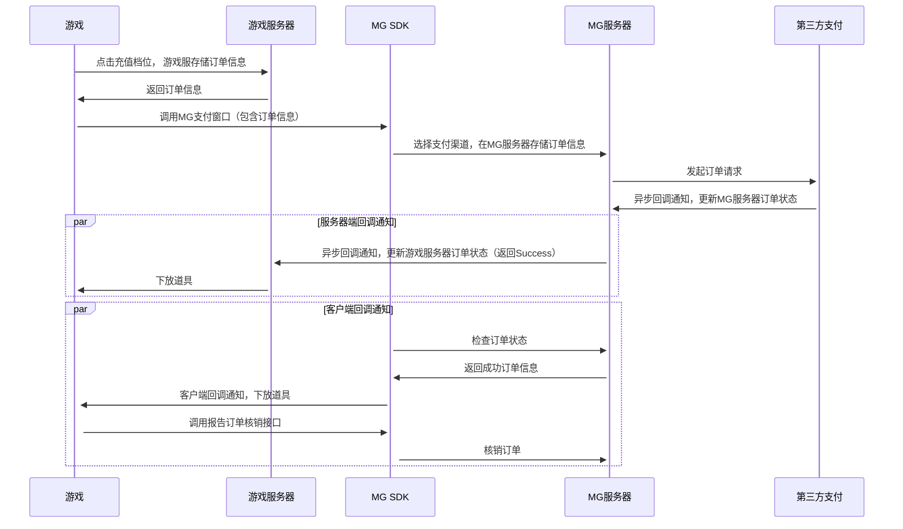

# Android SDK支付

## 1、 简介
　　 本文介绍了如何对接Miracle Games Android SDK的支付接口，打开支付方式选择窗口并接收支付回调。

## 2、 用户支付流程
### 推荐按以下流程实现支付
●  在发起支付调用时，在开发者的系统中先生成一个订单号，然后把此订单号通过comment参数传递给支付接口<br>
●  支付过程完成后，会由Miracle Games的服务器给开发者发起回调，其中包含了此comment信息，开发者可以通过此将该订单号标记为支付成功<br>
●  当游戏内存在多个价格相同的道具时，无需在MG后台为每个道具单独创建商品，只需创建一个通用商品即可。在调用支付接口时，将道具id传给conmment参数，支付完成后，MG会将此comment参数透传给开发者。开发者可依据此参数进行不同道具的下放。<br>
●  游戏服务器在收到MG服务器的回调通知时，需使用product_tag参数同游戏订单信息对比校验，或使用product_price_usd参数同道具价格对比校验，校验通过则下放道具。product_tag参数为开发者后台中维护的属性。属性名为"<span  style="color:blue"> 自定义标签"，建议存储道具ID。MG服务器会将此属性值经过 url编码后传给游戏服务器。<br>
●  若开发者没有服务器，则可以通过客户端接收回调事件，完成游戏道具的发放<br>

## 3、 用户支付
　　 调用该接口后，会打开平台的支付界面。当用户支付完成或取消支付时，会发送响应的支付回调消息。
```java
// this 为Android Activity对象	
// goodsKey: 商品Key, 创建商品时由MiracleGames生成 
// comment: 自定义参数，传递前进行urlencode，完成支付后会把该参数原样返回给开发者。
// callbackId:可为空, 服务器回调地址Id, 在设置回调地址时由MiracleGames生成, 开发者可以设置多个回调地址, 该笔交易将会给指定Id的回调地址发起支付成功的回调
// 如果设置了回调地址, 但未指定id, 即CallbackId=null, 将使用默认回调地址；如果指定了Id, 但该Id不存在, 将不能支付。如果不使用服务器回调, 请忽略该属性。
MGSdkPlatform.getInstance().pay(this, goodsKey, comment, callbackId,
	new MGPayListener() { 
		@Override
		public void onSuccess(String msg) {
			//无需处理
		}
		@Override
		public void onFailed(String msg) {
			//无需处理
		}
	}
);
```

## 4、 支付成功后服务器端回调开发者服务器
　　在玩家支付完成之后，Miracle Games会根据开发者在Miracle Games开发者平台上创建的应用回调地址[（参考）](https://doc.mguwp.net/appcallback.html)，通过GET请求的形式将支付结果作为参数通知到开发者服务器。<br>
　　完整的服务器回调以及解密流程，请参考链接中的[（第四章节：支付成功后服务器端回调开发者服务器）](https://doc.mguwp.net/androidpayment.html)
## 5、 支付成功后接收客户端回调事件
　　 如果游戏有服务器可接收回调，则无需接入此功能，直接接入服务器端的支付回调。<br>
　　● 注册客户端支付回调事件，推荐放入onCreate方法中
```java
protected void onCreate(Bundle savedInstanceState) {
	super.onCreate(savedInstanceState);

	MGSdkPlatform.getInstance().Assets(new MGAssetsListener() {
		@Override
		public void onSuccess(ArrayList assetsInfoList) {

			Log.d(TAG, "资产变更;" + "assetsInfoList===" + assetsInfoList.size());
			desc+="资产变更,assetsInfoList.size():=" + assetsInfoList.size()+"\n";
			for (AssetsInfo assetInfo : assetsInfoList) {
				//开发者在此处，进行道具下放

				MGSdkPlatform.getInstance().ReportFulfillmentAsync(assetInfo);//报告核销
			}
			desc+="资产已核销";
		}
	});

}
```
